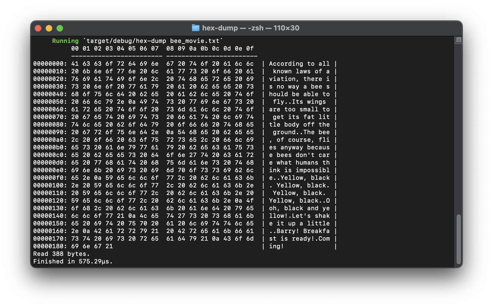

# Hex Dump CLI Tool

A simple colored hex dump CLI tool written in Rust.  
It reads a file's raw bytes and prints them in a structured hex + ASCII table, with color-coded output.

---

## ✨ Features

- **Hex + ASCII display** side-by-side.
- **Color-coded bytes**:
  - **Green**: Printable ASCII characters.
  - **Dimmed gray**: Spaces.
  - **Red**: Non-printable characters.
- **Aligned offsets** for easy navigation.
- **Groups of 8 bytes** separated for clarity.

---

## 📦 Installation

Make sure you have Rust installed ([Install Rust](https://www.rust-lang.org/tools/install)).

Clone this repository and install dependencies:

```bash
git clone https://github.com/your-username/hex-dump-rust.git
cd hex-dump
cargo build
````

---

## ▶ Usage

Run with:

```bash
cargo run -- <filename>
```

Example:

```bash
cargo run -- bee_movie.txt
```

Output:



---

## 🛠 Dependencies

- [`colored`](https://crates.io/crates/colored) – For terminal colors.

Install `colored`:

```bash
cargo add colored
```

---
